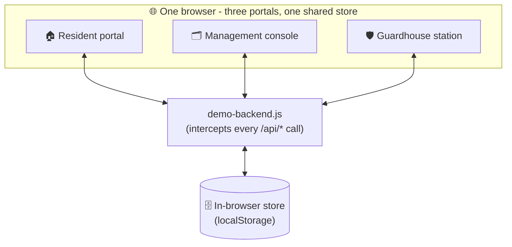
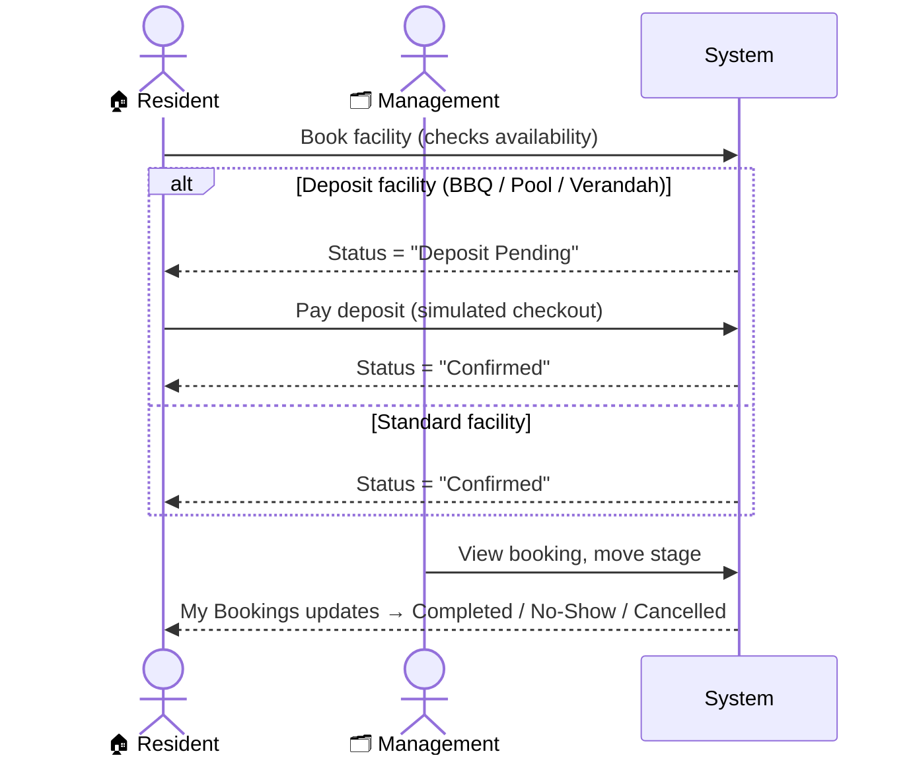
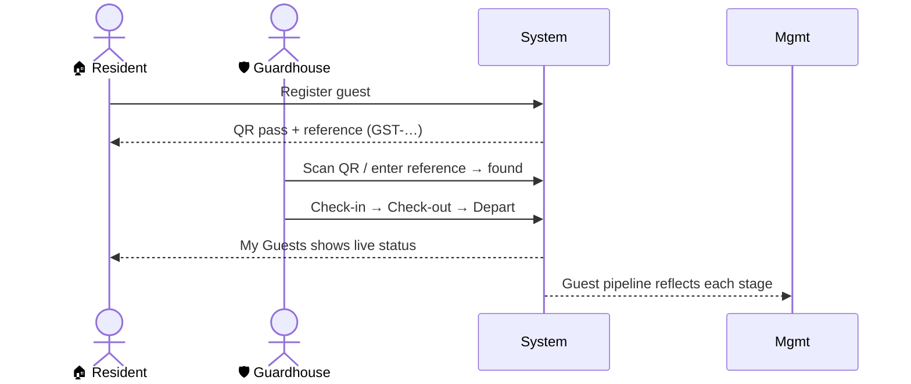
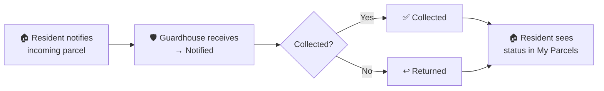

# The Lumina

A complete, three-role property-management platform for a residential community - covering everything residents, building management, and the guardhouse do day to day:
facility bookings, guest passes with QR check-in, parcel tracking, defect reports,
feedback, move-in/out scheduling, deposits & payments, announcements with RSVP,
two-way messaging, and a shared document library.

**🔗 Live demo:** https://the-lumina.vercel.app
*(No login required - every portal opens ready to explore.)*

> **About this build.** This is a self-contained **portfolio demo** of a production
> system. It runs **entirely in the browser** - no login, no database, no third-party
> services, and no network calls leave the page. Every screen is populated with
> realistic data and every action works against an in-browser mock, so reviewers can
> click through the full product safely. See [How it works](#how-it-works).

---

## Table of contents
- [What it is](#what-it-is)
- [The three roles](#the-three-roles)
- [Feature tour](#feature-tour)
- [End-to-end system flow](#end-to-end-system-flow)
- [How it works](#how-it-works)
- [Tech stack](#tech-stack)
- [Run it locally](#run-it-locally)
- [Project structure](#project-structure)
- [Notes](#notes)

---

## What it is

The Lumina digitises the operations of a residential condominium into one connected
system with **three portals** that talk to each other in real time:

| Portal | Who uses it | Opens as |
| --- | --- | --- |
| **Resident** (`/portal.html`) | Home owners & tenants | Alex Tan · Unit 12-09 |
| **Management** (`/management.html`) | Building management office | Management console |
| **Guardhouse** (`/guardhouse-portal.html`) | Security / front desk | Guard station |

The whole point is the **hand-offs between roles**: a resident books a facility or
registers a guest, management reviews and advances it, the guardhouse verifies people
and parcels at the gate - and each step is reflected back to the others instantly.

---

## The three roles

### 🏠 Resident portal
The resident's home base. Dashboard with upcoming bookings and notices, plus self-service
for every request they'd otherwise phone the office about.

### 🗂️ Management console
The back office. Every resident request lands here as a pipeline card that management
moves through its lifecycle (e.g. *Deposit Pending → Confirmed → Completed*), plus tools
to publish announcements, track RSVPs, manage payments, message residents, and maintain
the resident directory and document library.

### 🛡️ Guardhouse station
The gate. Scan or type a guest-pass QR / reference to verify a visitor and check them
**in → out → departed**; look up parcels and update their status; all activity lands in a
shared daily log.

---

## Feature tour

<details>
<summary><strong>Resident portal</strong></summary>

- **Dashboard** - upcoming bookings, latest notices, parcel-waiting banner.
- **Facility booking** - pick a facility (pool, tennis, squash, basketball, gym, fitness,
  BBQ, verandah), see live slot availability, book, edit, or cancel. Deposit facilities
  route through payment before confirming.
- **My bookings** - active + history with live status badges.
- **Guest registration** - register a visitor, get a QR guest pass + reference code.
- **Parcels** - notify the guardhouse of an incoming parcel and track its status.
- **Defects** - report a maintenance issue (with photo + urgency) and track progress.
- **Feedback** - complaints, feedback, and suggestions with categories.
- **Move in / out** - schedule a move (service lift) with deposit handling.
- **Payments** - pay booking/move deposits (simulated checkout) and view payment history.
- **Announcements & RSVP** - read management notices; RSVP to events with a head count.
- **Messages** - two-way thread with management.
- **Resources** - download house rules, guides, and safety documents.
</details>

<details>
<summary><strong>Management console</strong></summary>

- **Bookings board** - every facility booking with stage controls.
- **Pipelines** - guests, parcels, defects, feedback, and moves as manageable stage cards.
- **Guest desk** - register guests on a resident's behalf (with QR).
- **Residents** - directory of units, contacts, and types.
- **Announcements** - publish general notices, events (with RSVP), or maintenance windows
  that can block a facility for a time range; track RSVP responses and head counts.
- **Payments** - full payment ledger.
- **Inbox** - resident conversations; reply, resolve, or start a new thread.
- **Resources** - upload/manage documents shown to residents.
</details>

<details>
<summary><strong>Guardhouse station</strong></summary>

- **Guest verification** - QR scan or reference lookup → check-in / check-out / depart.
- **Parcel desk** - look up a parcel by reference and set its status
  (received/notified → collected → returned).
- **Activity log** - shared, resets daily; every action is recorded.
</details>

---

## End-to-end system flow

How the roles connect. Everything below is a real, clickable path in the demo.

### System overview



### Facility booking lifecycle



### Guest pass lifecycle



### Parcel lifecycle



**Other connected flows:** a **defect / feedback / move** request a resident submits appears
as a management pipeline card and moves through its stages; **announcements** management
publishes show up in the resident's Notices, and **RSVPs** residents submit are tallied in
management; **messages** thread live between resident and management in both directions.

---

## How it works

The production front-end talks to a REST API. For this public demo that API is replaced
by a **client-side mock**, so the app has zero backend dependencies and can be hosted as a
static site:

- **[`public/js/demo-backend.js`](public/js/demo-backend.js)** overrides `window.fetch`,
  intercepts every `"/api/…"` request, and serves it from an in-browser store
  (`localStorage`) that's seeded with realistic demo data on first load.
- **All three portals share the same store**, so a resident's action shows up in
  management and at the guardhouse - the cross-portal hand-offs are genuine, just kept
  inside the browser.
- **Authentication is bypassed** - a fixed demo session is seeded so anyone can explore
  without credentials.
- **Payments** open a **simulated** checkout page ([`public/demo-pay.html`](public/demo-pay.html));
  nothing is ever charged and no request leaves the browser.

Reset all demo data anytime from the browser console:

```js
window.__meridianDemoReset()
```

The original Node/Express back end is kept under **[`backend/`](backend/)** as a **reference**
implementation (JWT auth, security headers, input hardening, data models, service layer,
pipeline integration). It is **not used** by this demo - `server.js` only serves the static
front-end - and all real credentials, domains, and tenant identifiers have been removed.

---

## Tech stack

| Layer | Technology |
| --- | --- |
| Front-end | Vanilla JavaScript (no framework), component-style modular CSS design system, responsive layouts, light/dark theme |
| UI libraries | SweetAlert2 (dialogs), QRCode.js (guest-pass QR), jsQR (QR scanning) |
| Demo layer | Client-side `fetch` mock + `localStorage` store (no backend needed) |
| Reference back end | Node.js, Express, Helmet, JWT, Mongoose (kept for reference only) |
| Hosting | Static deploy on Vercel |

---

## Run it locally

```bash
# from the repo root
cd backend
npm install
npm start
```

Open **http://localhost:3000** and pick a portal from the landing page. No credentials needed.

You can also serve the `public/` folder with any static file server, or deploy it to any
static host - the app needs no server-side runtime.

---

## Project structure

```
the-lumina/
├── public/                     # the entire demo (this is what gets deployed)
│   ├── index.html              # landing page → 3 portals
│   ├── portal.html             # resident portal
│   ├── management.html         # management console
│   ├── guardhouse-portal.html  # guardhouse station
│   ├── demo-pay.html           # simulated payment page
│   ├── css/                    # modular design system (portal / management / shared)
│   ├── js/
│   │   ├── portal.controller.js
│   │   ├── management.controller.js
│   │   ├── guardhouse.controller.js
│   │   └── demo-backend.js     # ← client-side mock API + seed data
│   └── asset/                  # facility imagery, logo
├── backend/                    # reference Node/Express implementation (not used by the demo)
│   ├── server.js               # serves the static front-end only
│   ├── controllers/  models/  routes/  services/  config/  middleware/
│   └── .env.example
├── vercel.json                 # static deploy config (serve public/, no build)
└── package.json
```

---

## Notes

- This repository is an **independent portfolio copy**. It is not connected to, and never
  communicates with, any production deployment or third-party service.
- Demo data lives only in the visitor's browser and resets when storage is cleared.

---

<p align="center"><em>Built by Brixsonn Romero · Portfolio demo</em></p>
