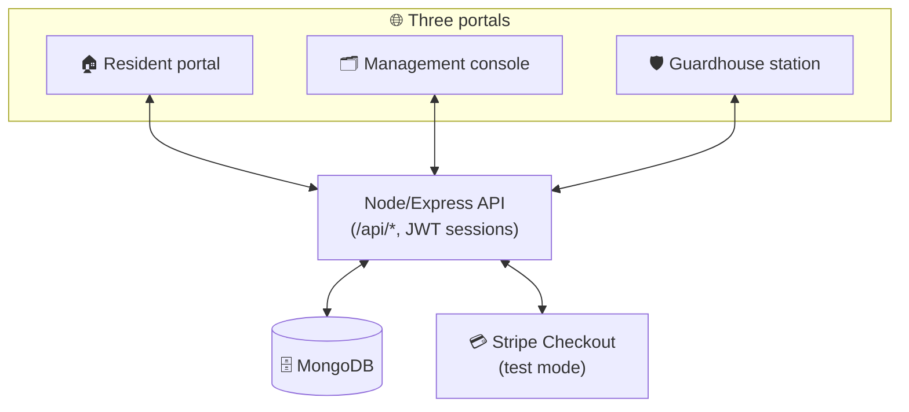
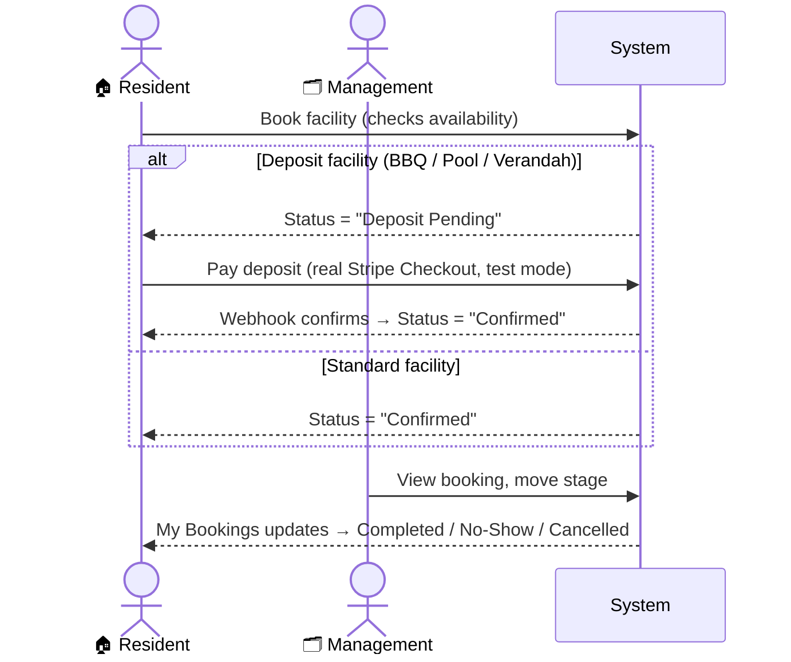
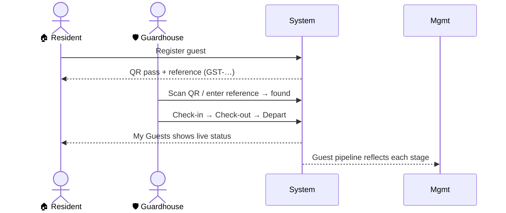
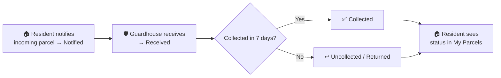

# The Lumina

A complete, three-role property-management platform for a residential community - covering everything residents, building management, and the guardhouse do day to day:
facility bookings, guest passes with QR check-in, parcel tracking, defect reports,
feedback, move-in/out scheduling, deposits & payments, announcements with RSVP,
two-way messaging, and a shared document library.

**🔗 Live:** https://the-lumina-production.up.railway.app/
*(Sign in with the test credentials below, or register your own resident account.)*

### Test credentials

Each portal has its own real, Mongo-backed login — sign in with these, or register
your own resident account from the sign-up screen and use that instead:

| Portal | Login | Password |
| --- | --- | --- |
| 🏠 Resident (`/portal.html`) | `resident@thelumina.test` (Test Resident, Unit #01-01) | `dS4xlvFX2ytBb2!` |
| 🗂️ Management (`/management.html`) | `admin` | `hBJSjqnm7OrqAa1!` |
| 🛡️ Guardhouse (`/guardhouse-portal.html`) | `guard` | `jK5U8AubeaQCc3!` |

Residents aren't limited to the test account - the **Register** tab on the resident
sign-in screen creates a genuine new account (Mongo-backed, same as the test one).

> **About this build.** This is a **fully live** portfolio project — every feature is
> backed by a real Node/Express + MongoDB API with JWT sessions and real Stripe
> Checkout (test mode) for deposits. There is no mock layer and no demo shortcut:
> each portal requires a real sign-in (use the [test credentials](#test-credentials)
> above, or register your own resident account). See [How it works](#how-it-works).

---

## Table of contents
- [Test credentials](#test-credentials)
- [What it is](#what-it-is)
- [The three roles](#the-three-roles)
- [Feature tour](#feature-tour)
- [End-to-end system flow](#end-to-end-system-flow)
- [How it works](#how-it-works)
- [Tech stack](#tech-stack)
- [Run it locally](#run-it-locally)
- [Project structure](#project-structure)
- [Notes](#notes)

---

## What it is

The Lumina digitises the operations of a residential condominium into one connected
system with **three portals** that talk to each other in real time:

| Portal | Who uses it | Sign in as |
| --- | --- | --- |
| **Resident** (`/portal.html`) | Home owners & tenants | Resident account |
| **Management** (`/management.html`) | Building management office | Management console |
| **Guardhouse** (`/guardhouse-portal.html`) | Security / front desk | Guard station |

The whole point is the **hand-offs between roles**: a resident books a facility or
registers a guest, management reviews and advances it, the guardhouse verifies people
and parcels at the gate - and each step is reflected back to the others instantly.

---

## The three roles

### 🏠 Resident portal
The resident's home base. Dashboard with upcoming bookings and notices, plus self-service
for every request they'd otherwise phone the office about.

### 🗂️ Management console
The back office. Every resident request lands here as a pipeline card that management
moves through its lifecycle (e.g. *Deposit Pending → Confirmed → Completed*), plus tools
to publish announcements, track RSVPs, manage payments, message residents, and maintain
the resident directory and document library.

### 🛡️ Guardhouse station
The gate. Scan or type a guest-pass QR / reference to verify a visitor and check them
**in → out → departed**; look up parcels and update their status; all activity lands in a
shared activity log.

---

## Feature tour

<details>
<summary><strong>Resident portal</strong></summary>

- **Dashboard** - upcoming bookings, latest notices, parcel-waiting banner.
- **Facility booking** - pick a facility (pool, tennis, squash,
  basketball, gym, fitness, BBQ, verandah), see live slot availability, book, edit, or
  cancel. Deposit facilities route through payment before confirming, with a 24-hour
  payment window that auto-cancels and releases the slot if missed.
- **My bookings** - active + history with live status badges.
- **Guest registration** - register a visitor, get a QR guest pass + reference code.
- **Parcels** - notify the guardhouse of an incoming parcel and track its status.
- **Defects** - report a maintenance issue (with photo + urgency) and track progress.
- **Feedback** - complaints, feedback, and suggestions with categories.
- **Move in / out** - schedule a move (service lift); a $200
  non-refundable admin fee + $2,000 refundable deposit, same 24-hour payment window
  and lifecycle as a facility deposit.
- **Payments** *(real Stripe Checkout)* - every facility and Move-In/Out deposit pays
  through an actual Stripe Checkout Session (test mode - no card is ever really
  charged) instead of a simulated form; a webhook confirms the booking the instant
  payment completes.
- **Announcements & RSVP** - read management notices; RSVP to events
  with a head count.
- **Messages** - two-way thread with management.
- **Resources** - download house rules, guides, and safety documents.
</details>

<details>
<summary><strong>Management console</strong></summary>

- **Bookings board** - every facility booking with stage controls,
  enforced legal stage transitions, and deposit refund/forfeit resolution (real Stripe
  refunds when a real charge is on file).
- **Move-In/Out board** - same stage controls + deposit refund/forfeit
  as the Bookings board, scoped to Move-In/Out requests.
- **Pipelines** - guests, parcels, defects, and feedback as manageable stage cards.
- **Guest desk** - register guests on a resident's behalf (with QR).
- **Residents** - directory of units, contacts, and types.
- **Announcements** - publish general notices, events (with RSVP), or
  maintenance windows that can block a facility for a time range; track RSVP responses
  and head counts.
- **Payments** - cross-pipeline pending-deposit + history overview,
  sourced directly from real booking/move records (no separate payment ledger to
  drift out of sync).
- **Inbox** - resident conversations; reply, resolve, or start a new thread.
- **Resources** - upload/manage documents shown to residents.
</details>

<details>
<summary><strong>Guardhouse station</strong></summary>

- **Guest verification** - QR scan or reference lookup → check-in / check-out / depart.
- **Parcel desk** - look up a parcel by reference and set its status
  (notified → received → collected → returned).
- **Activity log** - a shared feed (visitor + parcel), persisted in MongoDB and live
  across every guard station; entries can be cleared per category.
</details>

---

## End-to-end system flow

How the roles connect. Everything below is a real, clickable path in the app.

### System overview



### Facility booking lifecycle



### Guest pass lifecycle



### Parcel lifecycle



**Other connected flows:** a **defect / feedback** request a resident submits appears as a
management pipeline card and moves through its stages; a **Move-In/Out** request follows
the same deposit lifecycle as a facility booking (its own dedicated board, not a generic
pipeline card); **announcements** management publishes show up in the resident's Notices,
and **RSVPs** residents submit are tallied in management; **messages** thread live between
resident and management in both directions.

---

## How it works

Every feature runs on a real Node/Express + MongoDB API
([`backend/`](backend/), mounted at `/api/*` by `server.js`). There is no client-side
mock — each portal signs in against the real backend and reads/writes live data.

- **Auth** - resident/management/guardhouse sign-in are JWT-backed, each with its own
  httpOnly session cookie; residents can also self-register.
- **Facility booking** and **Move-In/Out** - availability/conflicts (facility only),
  deposit lifecycle (pending → held → refunded/forfeited), legal stage transitions, and
  the 24-hour deposit-expiry sweep are all enforced server-side against MongoDB - both
  share the same deposit-lifecycle design.
- **Payments** ([Stripe](https://stripe.com) Checkout, test mode) - every deposit (a
  facility booking's or a Move-In/Out's) is a real Checkout Session, split into a
  non-refundable-fee + refundable-deposit line item where applicable (e.g. the
  Verandah, or Move-In/Out). A webhook confirms the booking/move the instant payment
  completes, reusing an in-flight session (or reconciling an already-completed one)
  instead of ever risking a double charge. Refunds go back through Stripe for real,
  scoped to only the refundable portion.
- **Guests, parcels, defects, feedback** - each is its own Mongo-backed pipeline:
  residents submit (and can edit/withdraw while still open), the guardhouse verifies
  guests + parcels at the gate, and management advances every card through its stages.
  Parcels auto-return if uncollected 7 days after arrival.
- **Messages** - one conversation per resident, persisted in MongoDB, with real
  clear-on-read and read receipts on both sides.
- **Resources**, **Announcements/RSVP**, the **resident directory**, and the shared
  **guardhouse activity log** are all stored and served from MongoDB, live across every
  portal.

All real credentials, domains, and tenant identifiers have been removed from this copy -
see [`backend/.env.example`](backend/.env.example) for the environment variables a real
deployment needs.

---

## Tech stack

| Layer | Technology |
| --- | --- |
| Front-end | Vanilla JavaScript (no framework), component-style modular CSS design system, responsive layouts, light/dark theme |
| UI libraries | SweetAlert2 (dialogs), QRCode.js (guest-pass QR), jsQR (QR scanning) |
| Back end | Node.js, Express, Helmet, JWT, Mongoose/MongoDB - the single source of truth for every feature |
| Payments | [Stripe](https://stripe.com) Checkout + webhooks (test mode) - real deposit charges and refunds |
| Hosting | Railway (`node backend/server.js` serves the API and the static `public/` folder together) |

---

## Run it locally

```bash
# from the repo root
npm install
npm start
```

Open **http://localhost:3000**, pick a portal from the landing page, and sign in with the
[test credentials](#test-credentials) above (or register a new resident account).

The app needs a `backend/.env` to run - copy [`backend/.env.example`](backend/.env.example)
and fill in a `MONGO_URL` and `JWT_SECRET` at minimum; without a database connection every
`/api/*` route responds "Database not connected". Add
`STRIPE_SECRET_KEY`/`STRIPE_PUBLISHABLE_KEY`/`STRIPE_WEBHOOK_SECRET` (test-mode keys
from [dashboard.stripe.com/test/apikeys](https://dashboard.stripe.com/test/apikeys))
to also test real deposit payments end to end.

---

## Project structure

```
the-lumina/
├── public/                     # the entire app (this is what gets deployed)
│   ├── index.html              # landing page → 3 portals
│   ├── portal.html             # resident portal
│   ├── management.html         # management console
│   ├── guardhouse-portal.html  # guardhouse station
│   ├── css/                    # modular design system (portal / management / shared)
│   ├── js/
│   │   ├── portal.controller.js
│   │   ├── management.controller.js
│   │   └── guardhouse.controller.js
│   └── asset/                  # facility imagery, logo
├── backend/                    # Node/Express + MongoDB API — every feature (auth, bookings, moves, guests, parcels, defects, feedback, messages, resources, announcements, Stripe)
│   ├── server.js               # entry: serves public/ + mounts the API at /api/*
│   ├── controllers/  models/  routes/  services/  config/  middleware/
│   └── .env.example            # required env vars for deployment (Mongo, JWT secret, ...)
└── package.json
```

---

## Notes

- This is a **live, deployed portfolio project** on Railway with a real MongoDB
  database behind it - not a static mockup. Every feature genuinely persists, including
  real Stripe test-mode payments; sign in, submit a request, and it's still there on
  your next visit (and reflected across the other portals).
- All real credentials, tenant data, and identifying details have been scrubbed from
  this copy - the test accounts above are seeded specifically for this portfolio build.

---

<p align="center"><em>Built by QUAN7UM · Portfolio project</em></p>
