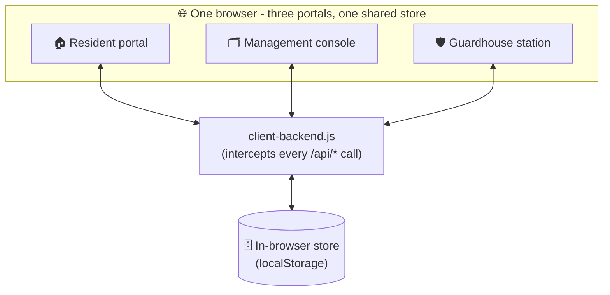
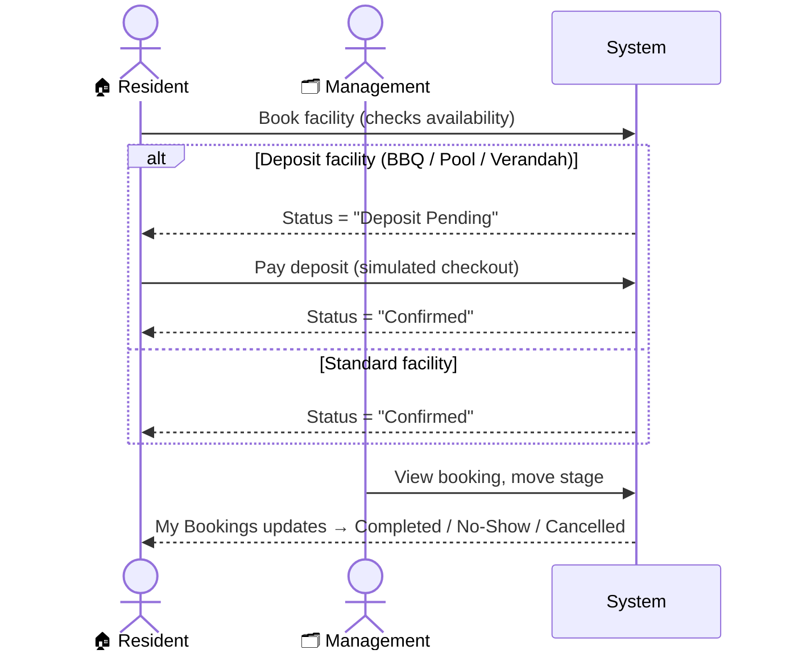
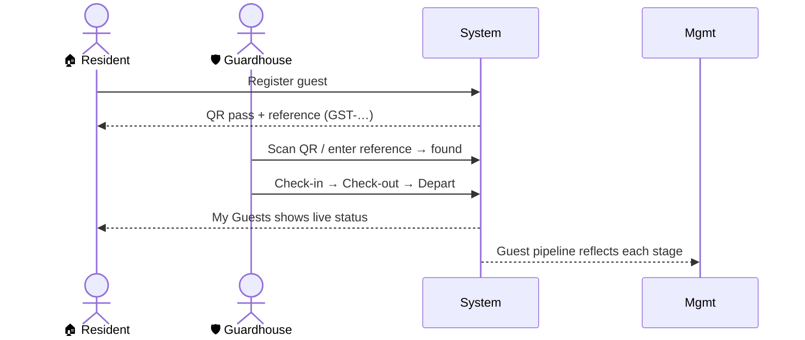
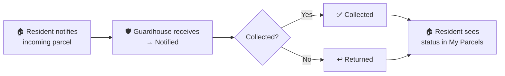

# The Lumina

A complete, three-role property-management platform for a residential community - covering everything residents, building management, and the guardhouse do day to day:
facility bookings, guest passes with QR check-in, parcel tracking, defect reports,
feedback, move-in/out scheduling, deposits & payments, announcements with RSVP,
two-way messaging, and a shared document library.

**🔗 Live:** https://the-lumina-production.up.railway.app/
*(Every portal opens straight into a furnished account - or sign in with the test
credentials below to see the real, persisted sign-in flow.)*

### Test credentials

Each portal has its own real, Mongo-backed login. Feel free to
sign out and sign back in with these, or register your own resident account from the
sign-up screen and use that instead:

| Portal | Login | Password |
| --- | --- | --- |
| 🏠 Resident (`/portal.html`) | `resident@thelumina.test` (Test Resident, Unit #01-01) | `dS4xlvFX2ytBb2!` |
| 🗂️ Management (`/management.html`) | `admin` | `hBJSjqnm7OrqAa1!` |
| 🛡️ Guardhouse (`/guardhouse-portal.html`) | `guard` | `jK5U8AubeaQCc3!` |

Residents aren't limited to the test account - the **Register** tab on the resident
sign-in screen creates a genuine new account (Mongo-backed, same as the test one).

> **About this build.** This is a **hybrid** portfolio project. Sign-in (resident,
> management, guardhouse), the resident directory, resources, announcements/RSVP, and
> **facility booking** are genuinely real - backed by MongoDB and JWT sessions.
> Everything else (guests, parcels, defects, feedback, moves, messages, the payments
> ledger) runs on a client-side mock so reviewers can click through the full product
> with zero setup. A **preview session is seeded on first visit**, so anyone can
> explore without credentials. See [How it works](#how-it-works).

---

## Table of contents
- [Test credentials](#test-credentials)
- [What it is](#what-it-is)
- [The three roles](#the-three-roles)
- [Feature tour](#feature-tour)
- [End-to-end system flow](#end-to-end-system-flow)
- [How it works](#how-it-works)
- [Tech stack](#tech-stack)
- [Run it locally](#run-it-locally)
- [Project structure](#project-structure)
- [Notes](#notes)

---

## What it is

The Lumina digitises the operations of a residential condominium into one connected
system with **three portals** that talk to each other in real time:

| Portal | Who uses it | Opens as |
| --- | --- | --- |
| **Resident** (`/portal.html`) | Home owners & tenants | Furnished resident account |
| **Management** (`/management.html`) | Building management office | Furnished management console |
| **Guardhouse** (`/guardhouse-portal.html`) | Security / front desk | Furnished guard station |

The whole point is the **hand-offs between roles**: a resident books a facility or
registers a guest, management reviews and advances it, the guardhouse verifies people
and parcels at the gate - and each step is reflected back to the others instantly.

---

## The three roles

### 🏠 Resident portal
The resident's home base. Dashboard with upcoming bookings and notices, plus self-service
for every request they'd otherwise phone the office about.

### 🗂️ Management console
The back office. Every resident request lands here as a pipeline card that management
moves through its lifecycle (e.g. *Deposit Pending → Confirmed → Completed*), plus tools
to publish announcements, track RSVPs, manage payments, message residents, and maintain
the resident directory and document library.

### 🛡️ Guardhouse station
The gate. Scan or type a guest-pass QR / reference to verify a visitor and check them
**in → out → departed**; look up parcels and update their status; all activity lands in a
shared daily log.

---

## Feature tour

<details>
<summary><strong>Resident portal</strong></summary>

- **Dashboard** - upcoming bookings, latest notices, parcel-waiting banner.
- **Facility booking** *(real backend)* - pick a facility (pool, tennis, squash,
  basketball, gym, fitness, BBQ, verandah), see live slot availability, book, edit, or
  cancel. Deposit facilities route through payment before confirming, with a 24-hour
  payment window that auto-cancels and releases the slot if missed.
- **My bookings** - active + history with live status badges.
- **Guest registration** - register a visitor, get a QR guest pass + reference code.
- **Parcels** - notify the guardhouse of an incoming parcel and track its status.
- **Defects** - report a maintenance issue (with photo + urgency) and track progress.
- **Feedback** - complaints, feedback, and suggestions with categories.
- **Move in / out** - schedule a move (service lift) with deposit handling.
- **Payments** - pay booking/move deposits (simulated checkout) and view payment history.
- **Announcements & RSVP** *(real backend)* - read management notices; RSVP to events
  with a head count.
- **Messages** - two-way thread with management.
- **Resources** *(real backend)* - download house rules, guides, and safety documents.
</details>

<details>
<summary><strong>Management console</strong></summary>

- **Bookings board** *(real backend)* - every facility booking with stage controls,
  enforced legal stage transitions, and deposit refund/forfeit resolution.
- **Pipelines** - guests, parcels, defects, feedback, and moves as manageable stage cards.
- **Guest desk** - register guests on a resident's behalf (with QR).
- **Residents** - directory of units, contacts, and types.
- **Announcements** *(real backend)* - publish general notices, events (with RSVP), or
  maintenance windows that can block a facility for a time range; track RSVP responses
  and head counts.
- **Payments** - full payment ledger.
- **Inbox** - resident conversations; reply, resolve, or start a new thread.
- **Resources** *(real backend)* - upload/manage documents shown to residents.
</details>

<details>
<summary><strong>Guardhouse station</strong></summary>

- **Guest verification** - QR scan or reference lookup → check-in / check-out / depart.
- **Parcel desk** - look up a parcel by reference and set its status
  (received/notified → collected → returned).
- **Activity log** - shared, resets daily; every action is recorded.
</details>

---

## End-to-end system flow

How the roles connect. Everything below is a real, clickable path in the app.

### System overview



### Facility booking lifecycle



### Guest pass lifecycle



### Parcel lifecycle



**Other connected flows:** a **defect / feedback / move** request a resident submits appears
as a management pipeline card and moves through its stages; **announcements** management
publishes show up in the resident's Notices, and **RSVPs** residents submit are tallied in
management; **messages** thread live between resident and management in both directions.

---

## How it works

This build is a genuine hybrid: some features hit a real Node/Express + MongoDB API,
the rest run on a client-side mock so the whole product is still explorable with zero
setup and zero credentials.

**Real backend** ([`backend/`](backend/), mounted at `/api/*` by `server.js`):
- **Auth** - resident/management/guardhouse sign-in are genuinely JWT-backed, each with
  its own httpOnly session cookie; residents can also self-register.
- **Facility booking** - availability, conflicts, deposit lifecycle (pending → held →
  refunded/forfeited), legal stage transitions, and the 24-hour deposit-expiry sweep are
  all enforced server-side against MongoDB.
- **Resources** and **Announcements/RSVP** - documents and notices are stored and served
  from MongoDB, shared live across the resident and management portals.

**Client-side mock** ([`public/js/client-backend.js`](public/js/client-backend.js)) -
overrides `window.fetch` for everything not listed above (guests, parcels, defects,
feedback, moves, messages, the payments ledger) and serves it from an in-browser store
(`localStorage`) seeded with realistic sample data, so the full product is still
click-through-able without a database. All three portals share this store, so a mocked
action still shows up across portals. Payments open a **simulated** checkout page
([`public/checkout.html`](public/checkout.html)); nothing is ever charged.

Reset all local (mocked) data anytime from the browser console:

```js
window.__luminaReset()
```

All real credentials, domains, and tenant identifiers have been removed from this copy -
see [`backend/.env.example`](backend/.env.example) for the environment variables a real
deployment needs.

---

## Tech stack

| Layer | Technology |
| --- | --- |
| Front-end | Vanilla JavaScript (no framework), component-style modular CSS design system, responsive layouts, light/dark theme |
| UI libraries | SweetAlert2 (dialogs), QRCode.js (guest-pass QR), jsQR (QR scanning) |
| Mock layer | Client-side `fetch` mock + `localStorage` store, for the features not yet on the real backend |
| Back end | Node.js, Express, Helmet, JWT, Mongoose/MongoDB - live for auth, resources, announcements, and facility booking |
| Hosting | Railway (`node backend/server.js` serves the API and the static `public/` folder together) |

---

## Run it locally

```bash
# from the repo root
npm install
npm start
```

Open **http://localhost:3000** and pick a portal from the landing page - no credentials
needed to look around (a preview session auto-seeds), or sign in with the
[test credentials](#test-credentials) above.

Real data (auth, bookings, resources, announcements) needs a `backend/.env` -
copy [`backend/.env.example`](backend/.env.example) and fill in a `MONGO_URL` and
`JWT_SECRET` at minimum. Without it, those routes respond "Database not connected"
and the app quietly falls back to the client-side mock for everything else.

---

## Project structure

```
the-lumina/
├── public/                     # the entire app (this is what gets deployed)
│   ├── index.html              # landing page → 3 portals
│   ├── portal.html             # resident portal
│   ├── management.html         # management console
│   ├── guardhouse-portal.html  # guardhouse station
│   ├── checkout.html           # simulated payment page
│   ├── css/                    # modular design system (portal / management / shared)
│   ├── js/
│   │   ├── portal.controller.js
│   │   ├── management.controller.js
│   │   ├── guardhouse.controller.js
│   │   └── client-backend.js   # ← client-side mock API + seed data
│   └── asset/                  # facility imagery, logo
├── backend/                    # real Node/Express + MongoDB API (auth, booking, resources, announcements)
│   ├── server.js               # local dev entry: serves public/ + mounts the API at /api/*
│   ├── controllers/  models/  routes/  services/  config/  middleware/
│   └── .env.example            # required env vars for a real deployment (Mongo, JWT secret, ...)
└── package.json
```

---

## Notes

- This is a **live, deployed portfolio project** on Railway with a real MongoDB
  database behind it - not a static mockup. The features marked *(real backend)*
  above genuinely persist; the rest (guests, parcels, defects, feedback, moves,
  messages, payments ledger) run on the client-side mock and reset when your browser
  storage is cleared.
- All real credentials, tenant data, and identifying details have been scrubbed from
  this copy - the test accounts above are seeded specifically for this portfolio build.

---

<p align="center"><em>Built by Brixsonn Romero · Portfolio project</em></p>
